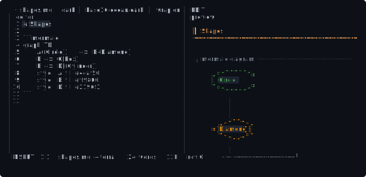
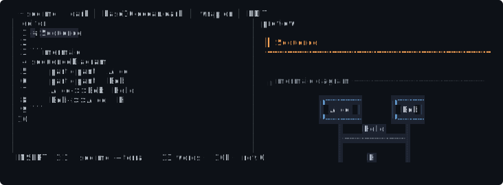

<div align="center">

# ⚡ terra

**A Markdown editor that doesn't need a browser.**

Edit on the left. Watch it render — beautifully — on the right.  
Syntax-highlighted code, boxed tables, live diagrams, and a typographic
rhythm that makes you forget you're in a terminal.

[](https://www.rust-lang.org)
[](LICENSE)
[]()
[]()

</div>

---


---

## Why terra

Most Markdown tools either live in the browser (heavy, disconnected from
your terminal workflow) or spit out a wall of monospaced text (functional,
but ugly). **terra is neither.**

It's a terminal-native editor with a **CSS-grade preview engine** that
paints blocks directly into your terminal buffer — rounded code cards,
boxed tables, colored blockquote bars, hanging-indent lists, heading
underline rules, and **smooth Unicode-braille diagrams**.

### ⚡ Instant

Opens in ~10 ms. No daemon, no server, no Electron. Just a 2.9 MB binary
that reads your file and lets you write.

### 🎨 Beautiful

The preview isn't styled text — it's **painted**. Every block is positioned
with full-width backgrounds, rounded corners, and a curated RGB palette:

```
╭ rust ───────────────────────────────╮
│ fn main() {                         │
│     println!("hello, world");       │
│ }                                   │
╰─────────────────────────────────────╯
```

### 🖼️ Diagrams, natively

Mermaid flowcharts, sequence diagrams, state machines, and class diagrams
render **inside the terminal** — no SVG, no external tools, no browser
required. Circles and curves are drawn with Unicode braille sub-cell
dots for smooth outlines:



Sequence diagrams get their own layout — participant headers, dashed
lifelines, labeled message arrows:



### ⌨️ Stays out of your way

| What | How |
|------|-----|
| **Search** | `/` with live highlight · `n` / `N` to jump |
| **Outline** | `Ctrl+O` — jump to any heading |
| **Go to line** | `:42` |
| **Undo / Redo** | `Ctrl+Z` / `Ctrl+R` |
| **Smart lists** | Enter continues the list; empty item outdents |
| **Mouse** | Click to position cursor · scroll to navigate |
| **Live sync** | Preview follows your cursor as you edit |

## Install

```bash
cargo install --path .
```

## Usage

```bash
terra README.md            # edit + preview
terra notes.md             # same thing
terra --dump README.md     # render one frame (no TTY — pipe it!)
```

## Keybindings

| Key | Action | Key | Action |
|-----|--------|-----|--------|
| `Ctrl+S` | Save | `Tab` | Switch pane |
| `Ctrl+Q` | Quit | `Ctrl+O` | Outline jump |
| `Ctrl+Z` | Undo | `Ctrl+R` | Redo |
| `Ctrl+D` | Duplicate line | `Ctrl+K` | Delete line |
| `/` `n` `N` | Search | `:` | Command mode (`:w` `:q` `:42`) |
| `Ctrl+W` | Toggle wrap | `Ctrl+T` | Cycle theme |
| `Ctrl+Y` | Toggle preview sync | `?` | Help |

## Markdown support

Everything from the original [Daring Fireball spec](https://daringfireball.net/projects/markdown/)
— atx and setext headers, inline/reference/automatic links, emphasis
(`*` `_` `**` `__`), inline code (single and multi-backtick), images,
blockquotes (nested), ordered/unordered/nested lists, indented and fenced
code blocks, horizontal rules, backslash escapes — verified by a
[69-test compliance suite](src/pretty.rs).

Plus: tables, task lists, footnotes, and four Mermaid diagram types.

## Built with

- [ratatui](https://crates.io/crates/ratui) — terminal UI framework
- [pulldown-cmark](https://crates.io/crates/pulldown-cmark) — Markdown parser
- [syntect](https://crates.io/crates/syntect) — syntax highlighting

## License

MIT — see [LICENSE](LICENSE).
